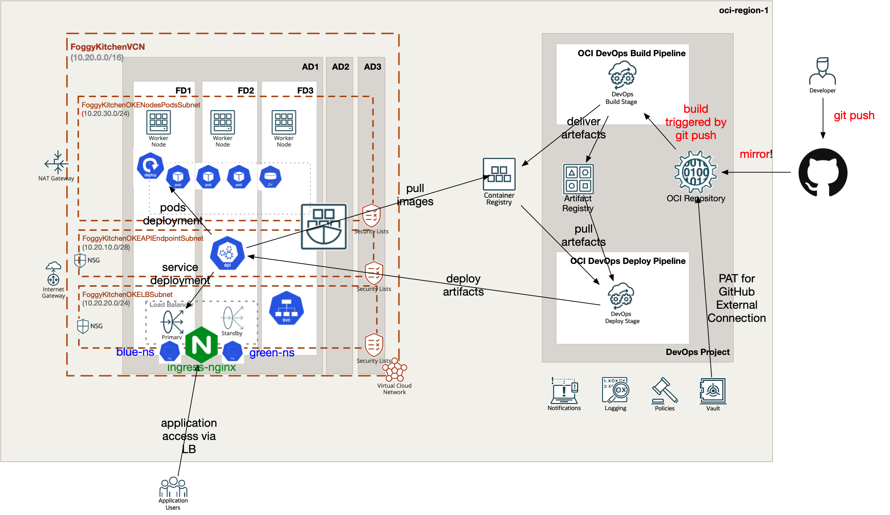

# FoggyKitchen OCI DevOps Service with Terraform 

## LESSON 8 - OCI DevOps Blue-Green Deployment

In our additional lesson, we will explore advanced deployment strategies by configuring a Blue-Green Deployment pipeline in OCI DevOps Service. This comprehensive lesson covers key stages to facilitate a seamless and reliable deployment process.

We will begin by setting up the Blue-Green Deploy Stage, where we deploy the new version of our application alongside the existing version. This allows for parallel environments, with the blue environment representing the current production version and the green environment representing the new version.

During a Blue-Green Deployment, the traffic is redirected from the blue environment to the green environment all at once. This ensures a seamless transition, as the switch occurs instantly without any gradual traffic shifting.



## Deploy Using Oracle Resource Manager

1. Click [](https://cloud.oracle.com/resourcemanager/stacks/create?region=home&zipUrl=https://github.com/mlinxfeld/terraform-oci-devops/releases/latest/download/terraform-oci-devops-lesson8.zip)

    If you aren't already signed in, when prompted, enter the tenancy and user credentials.

2. Review and accept the terms and conditions.

3. Select the region where you want to deploy the stack.

4. Follow the on-screen prompts and instructions to create the stack.

5. After creating the stack, click **Terraform Actions**, and select **Plan**.

6. Wait for the job to be completed, and review the plan.

    To make any changes, return to the Stack Details page, click **Edit Stack**, and make the required changes. Then, run the **Plan** action again.

7. If no further changes are necessary, return to the Stack Details page, click **Terraform Actions**, and select **Apply**. 

## Deploy Using the Terraform CLI

### Clone of the repo
Now, you'll want a local copy of this repo. You can make that with the commands:

Clone the repo from github by executing the command as follows and then go to proper subdirectory:

```
Martin-MacBook-Pro:~ martinlinxfeld$ git clone https://github.com/mlinxfeld/terraform-oci-devops.git

Martin-MacBook-Pro:~ martinlinxfeld$ cd terraform-oci-devops/

Martin-MacBook-Pro:terraform-oci-devops martinlinxfeld$ cd lesson8_deveops_bluegreen_deployment

```

### Prerequisites
Create environment file with TF_VARs:

```
Martin-MacBook-Pro:lesson8_deveops_bluegreen_deployment martinlinxfeld$ vi setup_oci_tf_vars.sh

export TF_VAR_tenancy_ocid="ocid1.tenancy.oc1..aaaaaaaasbkty(...)heqzzxn7pe64ksbia"
export TF_VAR_compartment_ocid="ocid1.compartment.oc1..aaaaaaaaiyy4srmrb32(...)ytywiucgbcp5ext6e4ahjewa"
export TF_VAR_user_ocid="ocid1.user.oc1..aaaaaaaaob4qbf27(...)uunizjie4his4vgh3jx5jxa"
export TF_VAR_fingerprint="85:ee:(...)37:b8:0d:0f:ea"
export TF_VAR_private_key_path="/home/opc/.oci/oci_api_key.pem"
export TF_VAR_region="eu-frankfurt-1"
export TF_VAR_github_pat_vault_secret_id="ocid1.vaultsecret.oc1.eu-frankfurt-1.amaaaaaadngk4gia426(...)ygv5x6ooa"
export TF_VAR_ocir_vault_secret_id="ocid1.vaultsecret.oc1.eu-frankfurt-1.amaaaaaadngk4giavvri7prkglx7gy5ip73q4(...)anih3lqfxhoa"

Martin-MacBook-Pro:lesson8_deveops_bluegreen_deployment martinlinxfeld$ source setup_oci_tf_vars.sh
```

### Create the Resources
Run the following commands:

```
Martin-MacBook-Pro:lesson8_deveops_bluegreen_deployment martinlinxfeld$ terraform init
    
Martin-MacBook-Pro:lesson8_deveops_bluegreen_deployment martinlinxfeld$ terraform plan

Martin-MacBook-Pro:lesson8_deveops_bluegreen_deployment martinlinxfeld$ terraform apply
```

### Destroy the Deployment
When you no longer need the deployment, you can run this command to destroy the resources:

```
Martin-MacBook-Pro:lesson8_deveops_blugreen_deployment martinlinxfeld$ terraform destroy
```

